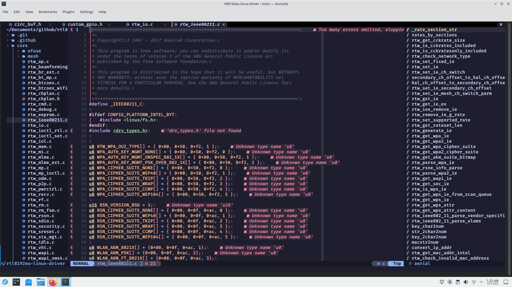
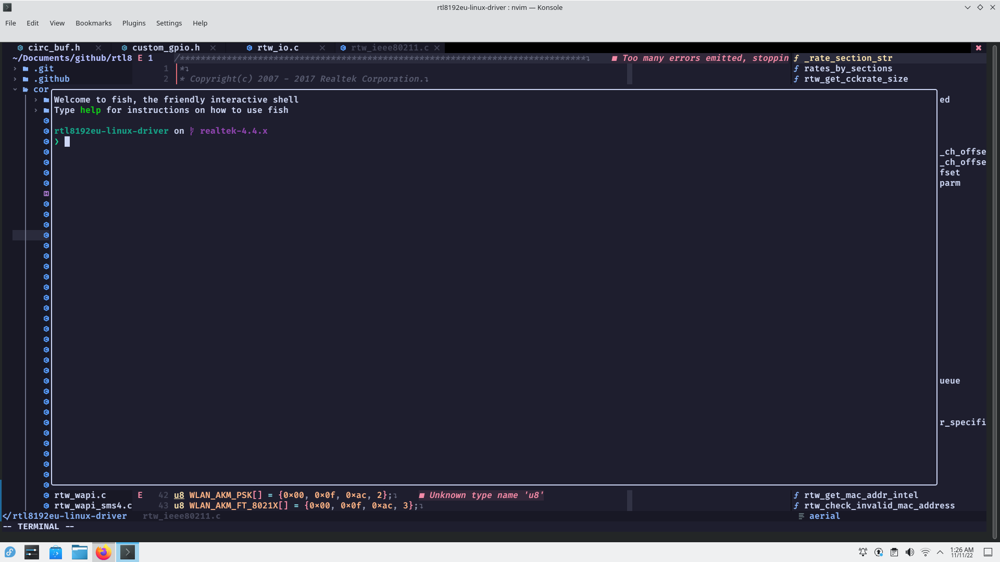

# NeoVIM config file

## Prerequisites

- [neovim v0.8.0 or above](https://neovim.io)
- [nodejs/npm](https://nodejs.org)
- [tree-sitter](https://tree-sitter.github.io/tree-sitter)
- [nerd-fonts](https://www.nerdfonts.com)

## Installation

```bash
rm -rf ~/.config/nvim ~/.local/share/nvim ~/.cache/nvim
git clone --depth 1 https://github.com/rusl2019/nvconf.git ~/.config/nvim
nvim
```

## Screenshot




## Plugin list

- [packer.nvim](https://github.com/wbthomason/packer.nvim)
- [nvim-tree.lua](https://github.com/kyazdani42/nvim-tree.lua)
- [toggleterm.nvim](https://github.com/akinsho/toggleterm.nvim)
- [nvim-ts-rainbow](https://github.com/p00f/nvim-ts-rainbow)
- [nvim-treesitter](https://github.com/nvim-treesitter/nvim-treesitter)
- [nvim-lspconfig](https://github.com/neovim/nvim-lspconfig)
- [mason.nvim](https://github.com/williamboman/mason.nvim)
- [mason-lspconfig.nvim](https://github.com/williamboman/mason-lspconfig.nvim)
- [cmp-nvim-lsp](https://github.com/hrsh7th/cmp-nvim-lsp)
- [cmp-buffer](https://github.com/hrsh7th/cmp-buffer)
- [cmp-path](https://github.com/hrsh7th/cmp-path)
- [cmp-cmdline](https://github.com/hrsh7th/cmp-cmdline)
- [nvim-cmp](https://github.com/hrsh7th/nvim-cmp)
- [cmp-vsnip](https://github.com/hrsh7th/cmp-vsnip)
- [vim-vsnip](https://github.com/hrsh7th/vim-vsnip)
- [LuaSnip](https://github.com/L3MON4D3/LuaSnip)
- [cmp_luasnip](https://github.com/saadparwaiz1/cmp_luasnip)
- [aerial.nvim](https://github.com/stevearc/aerial.nvim)
- [Comment.nvim](https://github.com/numToStr/Comment.nvim)
- [lspkind.nvim](https://github.com/onsails/lspkind.nvim)
- [nvim](https://github.com/catppuccin/nvim)
- [bufferline.nvim](https://github.com/akinsho/bufferline.nvim)
- [lualine.nvim](https://github.com/nvim-lualine/lualine.nvim)
- [nvim-web-devicons](https://github.com/kyazdani42/nvim-web-devicons)
- [indent-blankline.nvim](https://github.com/lukas-reineke/indent-blankline.nvim)
